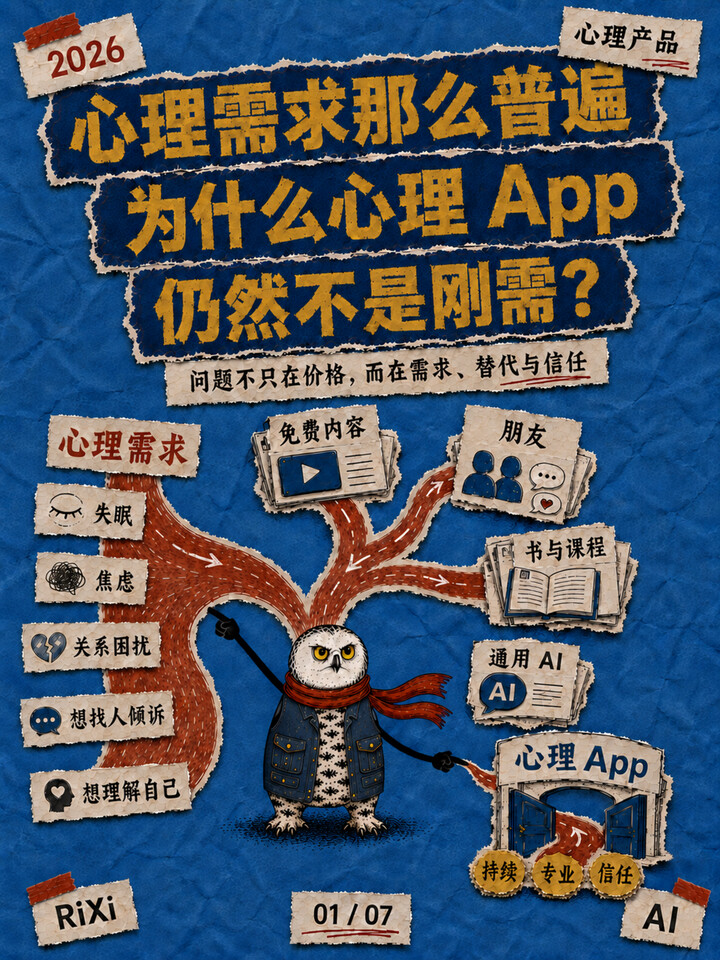

# Xiaohongshu Concept Explainer

Turn articles, notes, screenshots, documents, keywords, and mixed source material into clear, research-backed Xiaohongshu knowledge infographics for Chinese-speaking beginners.

This skill goes beyond simple summarization. It identifies the strongest publishable angle, verifies important claims, builds a card-by-card narrative, defines a coherent visual system, and checks the final 3:4 image set before delivery.

## What It Does

- Analyzes long-form and mixed-format source material.
- Identifies a focused, beginner-friendly topic instead of summarizing everything.
- Cross-checks important facts with at least two reliable sources.
- Plans the complete card sequence before rendering images.
- Writes concise Chinese copy designed for fast mobile reading.
- Produces one recommended title, two alternative titles, and a Xiaohongshu caption of no more than 200 Chinese characters.
- Maintains visual and character consistency across the entire series.
- Separates AI-generated illustration from deterministic Chinese typography.
- Runs full-size and thumbnail-size quality checks before delivery.
- Learns from visual debugging without turning one-off corrections into permanent rules.

## Example Output

The following examples come from a seven-card Xiaohongshu knowledge-infographic series.

The series uses a recurring snowy-owl character, editorial collage textures, deterministic Chinese typography, flexible narrative composition, and a consistent 3:4 portrait format.

<table>
  <tr>
    <td width="33.33%" valign="top">
      
    </td>
    <td width="33.33%" valign="top">
      
    </td>
    <td width="33.33%" valign="top">
      
    </td>
  </tr>
  <tr>
    <td align="center" valign="top">
      <strong>Cover</strong><br />
      One visible question and a strong visual promise.
    </td>
    <td align="center" valign="top">
      <strong>Information Structure</strong><br />
      A narrative route instead of a rigid information grid.
    </td>
    <td align="center" valign="top">
      <strong>Final Takeaway</strong><br />
      A visual path that closes the argument.
    </td>
  </tr>
</table>

## Workflow

The skill uses a gated production process.

### 1. Select the Topic

Inventory the source material and identify the smallest useful idea with genuine publishing value.

The skill does not mechanically summarize every piece of input.

### 2. Resolve the Concept

Define the central concept, clarify ambiguous terms, verify important claims, and establish the factual boundary.

### 3. Confirm the Card Plan

Assign one primary communication job to every card before image production begins.

### 4. Write the Script

Create concise, scannable Chinese copy with clear hierarchy, accurate wording, and explicit factual boundaries.

### 5. Design and Render

Lock a visual profile for the series and produce exact 3:4 portrait cards.

### 6. Quality Assurance

Inspect:

- typography;
- Chinese character accuracy;
- composition;
- visual continuity;
- factual accuracy;
- character consistency;
- full-size readability;
- thumbnail readability.

### 7. Learn from Debugging

Classify user feedback as:

- reusable skill-wide guidance;
- visual-system or QA reference;
- project-specific configuration;
- one-off correction.

This prevents temporary adjustments from becoming permanent global rules.

## Visual Production Principles

- Use an exact **3:4 portrait ratio**.
- The recommended canvas size is **1242 × 1656 px**.
- Generate one formal candidate per card unless the user explicitly requests alternatives.
- Keep the approved style stable throughout one series.
- Do not force one project’s art direction onto unrelated future projects.
- Prefer asymmetric grids, narrative flow, and purposeful negative space over rigid four-quadrant layouts.
- Treat explanatory text as the primary content.
- Illustration must never obstruct important text.
- Do not rely on an image-generation model for important Chinese copy.
- Render approved Chinese wording with a deterministic typesetting tool.
- Check whether the cover title remains readable at Xiaohongshu feed-thumbnail size.
- Preserve recurring editorial labels consistently when required, such as `2026`, `RiXi`, `AI`, and a short topic label.

## Optional Snowy-Owl Character System

The repository includes an optional snowy-owl mascot specification.

This character system is used only when a project explicitly selects the snowy owl. It is not the default art direction for every Xiaohongshu post.

The character rules cover:

- stable facial and species identity;
- exactly two black stick-figure arms when performing actions;
- no wings used as human hands;
- clothing and scarf construction;
- no oval wing shapes protruding through clothing;
- visible short legs and grounded claws in full-body standing poses;
- role-specific props and wardrobe;
- flexible placement instead of repeatedly fixing the owl in the lower-left corner;
- consistent appearance across all cards in the same series.

See [`references/snowy-owl-mascot.md`](references/snowy-owl-mascot.md) for the complete specification.

## Example Prompt

```text
Use $xiaohongshu-concept-explainer to analyze the material I provide.

First, recommend the strongest beginner-friendly topic and define the content boundary. Do not mechanically summarize all source material.

After I confirm the topic:

1. verify important facts with reliable sources;
2. plan the complete card series;
3. write the Chinese copy for every card;
4. define a consistent visual system;
5. produce a 3:4 Xiaohongshu infographic series;
6. inspect Chinese typography, visual continuity, factual accuracy, and thumbnail readability before delivery.

Generate the cover first. Continue with the remaining cards only after the visual direction is confirmed.
```

The user may provide:

- long-form articles;
- links;
- notes;
- Markdown files;
- documents;
- screenshots;
- keywords;
- reference images;
- multiple input formats combined.

## Expected Deliverables

A complete project may include:

- one recommended topic;
- a clearly defined content boundary;
- one recommended Xiaohongshu title;
- two alternative titles;
- a Xiaohongshu caption of no more than 200 Chinese characters;
- a card-by-card content script;
- a visual-direction specification;
- illustration-generation prompts;
- deterministic Chinese typography;
- a complete 3:4 image series;
- a final QA report;
- a structured web-debug feedback document when required.

## Repository Structure

```text
xiaohongshu-skill/
├── README.md
├── SKILL.md
├── agents/
│   └── openai.yaml
├── assets/
│   └── examples/
│       ├── 01-cover.jpg
│       ├── 03-four-services.jpg
│       └── 07-tiered-service.jpg
└── references/
    ├── image-handoff.md
    ├── qa-checklist.md
    ├── snowy-owl-mascot.md
    ├── visual-system.md
    └── web-debug-feedback.md
```

## Installation

Clone or download this repository:

```bash
git clone https://github.com/Irixil/xiaohongshu-skill.git
```

Then add the repository folder to the Skills directory supported by your Codex or agent environment.

Invoke the skill by name:

```text
$xiaohongshu-concept-explainer
```

## Best Use Cases

This skill is optimized for Chinese-language Xiaohongshu knowledge posts, especially:

- AI concepts for beginners;
- AI product management;
- product thinking;
- technology explainers;
- workflow and methodology explainers;
- article-to-infographic transformation;
- research-backed concept education;
- visual knowledge-card series.

## Scope and Boundaries

- It does not force a weak topic when the source material lacks a publishable angle.
- It does not invent statistics, quotations, user feedback, or sources.
- It does not treat an analogy as a formal definition.
- It does not hard-code one palette, mascot, page count, or composition across unrelated projects.
- It does not treat reference images as templates to copy.
- It does not allow illustration to interfere with explanatory text.
- It does not claim image-generation capability when the active product environment does not provide that tool.

## Documentation

For the complete operating procedure, see [`SKILL.md`](SKILL.md).

Additional references:

- [`references/visual-system.md`](references/visual-system.md) — visual-system guidance;
- [`references/qa-checklist.md`](references/qa-checklist.md) — final image-set quality checks;
- [`references/image-handoff.md`](references/image-handoff.md) — illustration and typography handoff;
- [`references/snowy-owl-mascot.md`](references/snowy-owl-mascot.md) — optional mascot specification;
- [`references/web-debug-feedback.md`](references/web-debug-feedback.md) — classified feedback from visual debugging.
